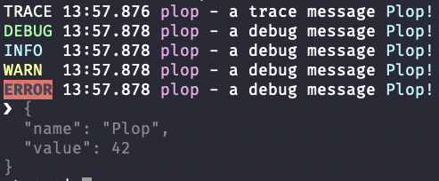
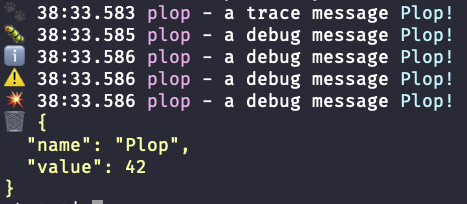

# Plop Logger


## Why another logger?

There are already plenty of logging related lib on [npm](https://www.npmjs.com/search?q=keywords:logging).
This is just a basic personal side project, so if you need a production-ready lib, you probably should use another lib.

This lib try to find the right balance between simplicity and features, with a good quality code.

## Basic usage

Install with `npm i plop-logger` or `yarn add plop-logger`.

```typescript
import { LogLevel, Logger } from "plop-logger";

// Get a logger with the `plop` name
const logger = Logger.getLogger("plop");

// Set level (default to Info)
logger.level = LogLevel.Debug;

// Basic usage
logger.trace("a trace message"); // omitted because level is Debug (> Trace)
logger.debug("a debug message"); // displayed because level is Debug
logger.info("a debug message"); // displayed because level is Debug (< Info)
logger.warn("a debug message"); // ...
logger.error("a debug message"); // ...

// Avoid computation if not necessary
logger.trace(() => `sum: ${1 + 1}`); // computation omitted
logger.info(() => `mult: ${3 * 14}`); // computation done

// Add an argument
logger.info("message to print", "Plop!"); // 'Plop!' is an argument
```

## Configuration

You can configure the logger with the static `Logger.config` property.

```typescript
import { defaultConfig, Logger } from "./../src";

// Create a custom config
// using ISO Date
// every logger named 'service' or 'service.*' should log warnings and errors
// but the logger named 'service.plopper' should log everything
const customConfig = {
  ...defaultConfig,
  levels: {
    service: "warn",
    "service.plopper": "trace" // level is case-insensitive
  },
  formatDate(date: Date) {
    return date.toISOString();
  }
};

// Setting the custom config
Logger.config = customConfig;

// Try it
const logger = Logger.getLogger("plop");
logger.info("test"); // Info 2019-08-10T17:23:19.736Z plop - test
```

Configuration:

- `appender: Console` : the appender, by default using the global `console`,
- `defaultLevel: LogLevel`: the default level, by default `Info`,
- `levels: LoggerLevels`: can configure level by name or parent name, empty by default,
- `formatLevel(level: LogLevel): string`: display the level, by default `LogLevel[level]`,
- `formatDate(now: Date): string`: display the log date, by default `Date#toLocaleTimeString()`,
- `formatName(name: string): string`: display the name, by default the name,
- `formatMessage(message: string): string`: format the message, by default the message,
- `formatArg(arg: any | null): string`: format the argument, by default use `toString()` or the empty string,
- `formatDump(obj: any): string[]`: format an object for a dump, by default use `JSON#stringify`.

## Color Configuration

You can use a colorful configuration:

```typescript
import { Logger } from "plop-logger";
import { colorConfig } from "plop-logger/extra/colorConfig";

// Use the colorConfig
Logger.config = colorConfig;
// ...
```



## Color + Emoji Configuration

The key feature of this project is the color + emoji configuration :

```typescript
import { Logger } from "plop-logger";
import { colorEmojiConfig } from "plop-logger/extra/colorEmojiConfig";

// Use the colorEmojiConfig
Logger.config = colorEmojiConfig;
// ...
```


